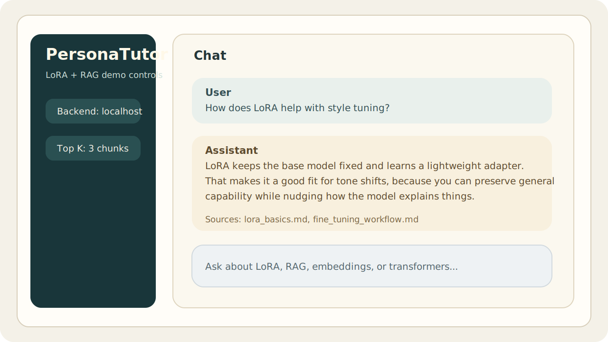
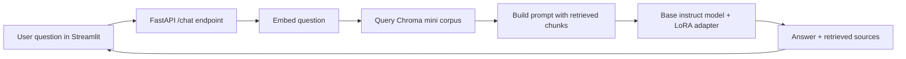

# LoRA Persona Chatbot with Mini RAG

Built a lightweight LLM assistant using LoRA fine-tuning for response style and RAG for document-grounded answers, with an end-to-end local chat interface.



## What this repo includes

- A synthetic style-tuning dataset with 144 instruction-response pairs in `train/data/style_pairs.jsonl`
- A tiny local RAG corpus with hand-written markdown notes on LoRA, RAG, transformers, embeddings, quantization, and fine-tuning
- A PEFT LoRA training script for a small instruct model
- A Chroma-backed retrieval pipeline using sentence-transformer embeddings
- A FastAPI backend and Streamlit frontend for local chat

## Smallest-credible scope

This project intentionally keeps the demo narrow:

- LoRA changes style, not factual knowledge
- RAG supplies factual grounding from a tiny local corpus
- The app shows answers plus retrieved sources
- The default stack stays local and easy to reason about

Default model choices:

- Base model: `Qwen/Qwen2.5-0.5B-Instruct`
- Embedding model: `sentence-transformers/all-MiniLM-L6-v2`
- Vector store: local Chroma persistence in `rag/chroma`

## Architecture



## Repo layout

```text
.
├── app
│   ├── backend
│   ├── frontend
│   └── shared
├── assets
├── rag
│   ├── data/docs
│   ├── ingest.py
│   └── retriever.py
├── train
│   ├── data/style_pairs.jsonl
│   ├── generate_dataset.py
│   ├── inference.py
│   └── train_lora.py
├── Makefile
├── README.md
└── requirements.txt
```

## Quickstart

```bash
python3 -m venv .venv
source .venv/bin/activate
python3 -m pip install -r requirements.txt
```

If `python3 -m venv` fails on Debian or Ubuntu, install `python3-venv` first or use another environment manager such as Conda or `uv`.

Generate or refresh the synthetic dataset:

```bash
python3 -m train.generate_dataset
```

Build the local vector index:

```bash
python3 -m rag.ingest
```

Train the LoRA adapter:

```bash
python3 -m train.train_lora --epochs 1
```

Run the backend:

```bash
uvicorn app.backend.main:app --reload
```

Run the frontend in another terminal:

```bash
PYTHONPATH=. streamlit run app/frontend/streamlit_app.py
```

## How chat works

1. The frontend sends the user question to FastAPI.
2. The backend retrieves the top markdown chunks from Chroma.
3. The prompt builder injects that context into a style-controlled chat prompt.
4. The base model answers with the LoRA adapter loaded when available.
5. The UI renders the answer and the source snippets used for retrieval.

## Notes and tradeoffs

- The first run downloads the base model and embedding model from Hugging Face.
- On CPU, inference is functional but slow. A small GPU makes the demo much nicer.
- The LoRA script is meant for a style demo, so the training set is synthetic by design.
- If the adapter directory does not exist yet, the app still runs with the base model only.

## Resume-ready description

Built a lightweight LLM assistant using LoRA fine-tuning for response style and RAG for document-grounded answers, with an end-to-end local chat interface.
