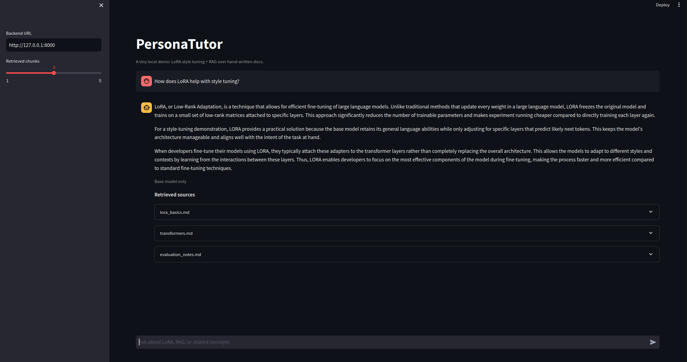

# Lightweight LLM Assistant: LoRA + RAG Demo

A lightweight end-to-end LLM project that demonstrates LoRA fine-tuning for response style adaptation and RAG for document-grounded question answering.

## Highlights

- LoRA fine-tuning on a small instruction dataset
- RAG pipeline over a local document corpus
- FastAPI backend for inference
- Streamlit frontend for interactive chat
- Modular project structure for training, retrieval, and serving

### Default model choices:

- Base model: `Qwen/Qwen2.5-0.5B-Instruct`
- Embedding model: `sentence-transformers/all-MiniLM-L6-v2`
- Vector store: local Chroma persistence in `rag/chroma`

## How chat works



1. The frontend sends the user question to FastAPI.
2. The backend retrieves the top markdown chunks from Chroma.
3. The prompt builder injects that context into a style-controlled chat prompt.
4. The base model answers with the LoRA adapter loaded when available.
5. The UI renders the answer and the source snippets used for retrieval.

## Quickstart

```bash
python3 -m venv .venv
source .venv/bin/activate
python3 -m pip install -r requirements.txt
```

Generate or refresh the synthetic dataset:

```bash
python3 -m train.generate_dataset
```

Build the local vector index:

```bash
python3 -m rag.ingest
```

Train the LoRA adapter:

```bash
python3 -m train.train_lora --epochs 1
```

Run the backend:

```bash
uvicorn app.backend.main:app --reload
```

Run the frontend in another terminal:

```bash
PYTHONPATH=. streamlit run app/frontend/streamlit_app.py
```